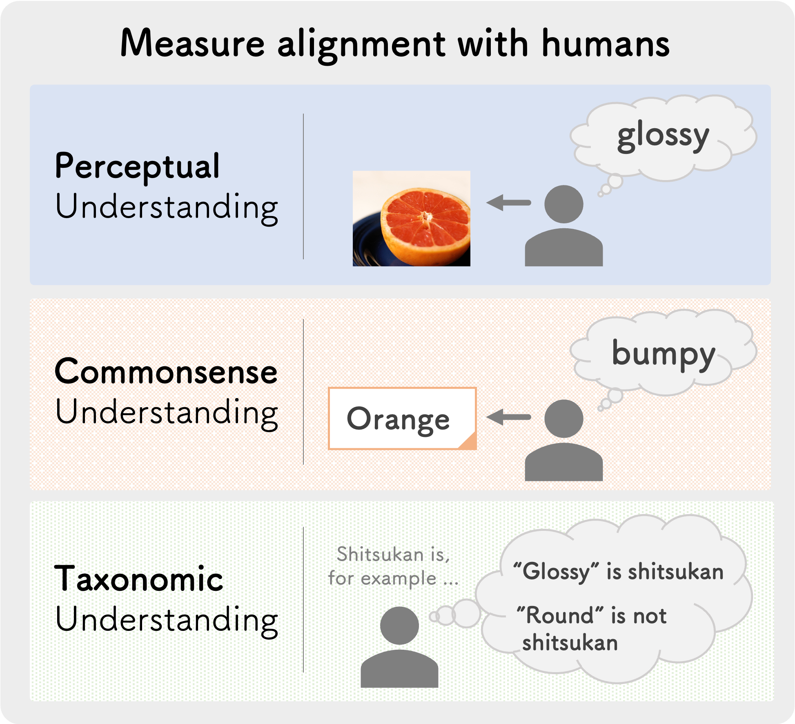

<div align="center">

shitsukan-eval
===========================
<h4>Evaluating Model (LLM / LVLM) Alignment with Human Perception</h4>



<div align="left">

<br>

(🚧 Here: Add description for this repo 🚧)

<details>
<summary><b>The currently supported LLMs are as follows:</b></summary>
<li>(🚧 Here: Add description for this repo 🚧)</li>
</details>

<br>

<details>
<summary><b>The currently supported LVLMs are as follows:</b></summary>
<li><a href="https://arxiv.org/abs/2310.03744">LLaVA-1.5</a></li>
<li><a href="https://arxiv.org/abs/2405.02246">Idefics2</a></li>
<li><a href="https://llava-vl.github.io/blog/2024-01-30-llava-next/">LLaVA-NeXT (LLaVA-1.6)</a></li>
<li><a href="https://arxiv.org/abs/2407.21783">Llama-3.2-Vision</a></li>
<li><a href="https://arxiv.org/abs/2408.03326">LLaVA-OneVision</a></li>
<li><a href="https://www.arxiv.org/abs/2408.12637">Idefics3</a></li>
<li><a href="https://arxiv.org/abs/2409.12191">Qwen2-VL</a></li>
<li><a href="https://www.arxiv.org/abs/2409.17146">Molmo</a></li>
<li>(🚧 Here: Add description for this repo 🚧)</li>
</details>

<br>

This library is experimental and under active development.
We plan to add some **breaking changes** in the future to improve the usability and performance of the library.

# Table of Contents

- [shitsukan-eval](#shitsukan-eval)
- [Table of Contents](#table-of-contents)
  - [Usage](#usage)
    - [1. Build Environment](#1-build-environment)
    - [2. Data Preparation](#2-data-preparation)
    - [3. Run Evaluation](#3-run-evaluation)
  - [Citation](#citation)
  - [Acknowledgement](#acknowledgement)

## Usage

### 1. Build Environment

```bash
cd $HOME
git clone git@github.com:<ANONYMOUS>/shitsukan-eval
cd $HOME/shitsukan-eval
uv python install 3.11
uv python pin 3.11
uv sync --no-dev
uv sync --dev --no-build-isolation
```

### 2. Data Preparation

```bash
# Prepare COCO 2017 images
mkdir -p $HOME/data/images
cd $HOME/data/images
wget http://images.cocodataset.org/zips/train2017.zip
wget http://images.cocodataset.org/zips/val2017.zip
unzip train2017.zip
unzip val2017.zip

# Prepare our Shitsukan datasets
mkdir -p  $HOME/shitsukan-eval/data
cd $HOME/shitsukan-eval/data
git lfs install
git clone https://huggingface.co/datasets/<ANONYMOUS>/Shitsukan
```

### 3. Run Evaluation

The following command evaluate the specified model on the specified tasks in shitsukan-eval.

```bash
CUDA_VISIBLE_DEVICES=0 uv run python -m shitsukan_eval \
    --model "<model_name_or_path>" \
    --tasks "<task_name>" \
    --sub-tasks "<sub-task_name>" \
    --lang "<lang>" \
    --image-dir "<base-image_path>" \
    --save-dir outputs \
    --verbose
```

<details>
<summary><b>Explanation of the available arguments</b></summary>

- `--model` (str): The name or path of the model to evaluate. (e.g., `"Qwen/Qwen2-VL-7B-Instruct"`)
- `--tasks` (str): The task name to evaluate.
  - Tasks that can be specified: `"perception"`, `"commonsense"`, `"taxonomic"`
- `--sub-tasks` (List[str]): List of sub-tasks within the tasks.
  - In case of `--tasks "perception"`, Sub-tasks that can be specified: `"generation"`, `"selection"`
  - In case of `--tasks "commonsense"`, Sub-tasks that can be specified: `"hoge"`
  - In case of `--tasks "taxonomic"`, Sub-tasks that can be specified: `"hoge"`
- `--lang` (str): Language to use for the evaluation (default: `"ja"`).
  - Language that can be specified: `"ja"`, `"en"`
- `--image-dir` (Optional[str]): Directory where input images are stored (optional).
  - If you specify `--image-dir="data"`, the evaluation script will reference the COCO 2017 images located at `data/images/coco2017/train2017/*.png` and `data/images/coco2017/val2017/*.png` during execution. If you have not prepared the COCO 2017 images, please download them in advance from [here](https://cocodataset.org/#download).
- `--save-dir` (str): Directory where evaluation results will be saved.
- `-v`, `--verbose`: If set, print detailed information during processing.

</details>

<br>

> [!NOTE]
> The configuration files for each task are located at `shitsukan_eval/tasks/{task}/{sub_task}/{task}_{sub_task}_{lang}.yaml`.  
> If you want to modify the settings, please change them here.

## Citation

```bibtex
@software{
author = {Anonymous},
month = {Aug},
title = {{shitsukan-eval}},
url = {https://github.com/<<ADD>>},
version = {0.1.0},
year = {2024}
}
```

## Acknowledgement

(🚧 Here: Add description for this repo 🚧)
